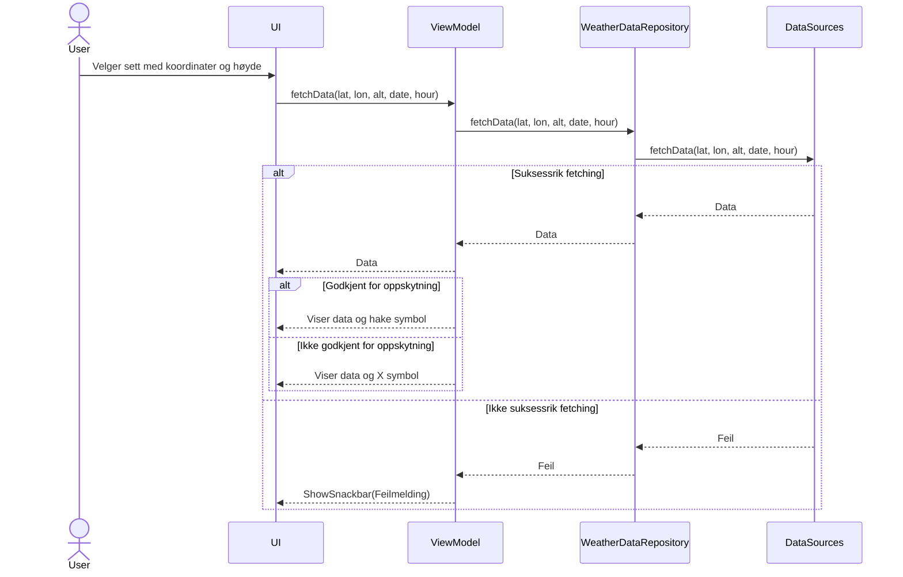
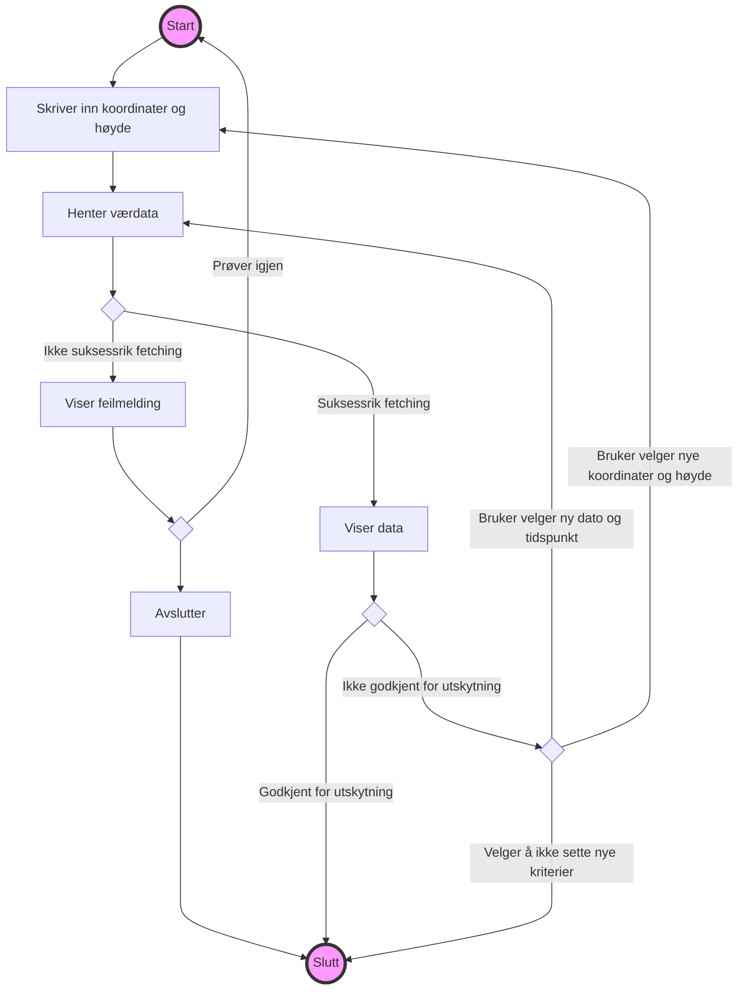

# Introduksjon

Denne filen gir en god oversikt og beskrivelse av modellene vi har utviklet for appen vår Liftoff. Modellene og diagrammene er laget ved hjelp av Mermaid, som er et verktøy som lar oss visualisere modellene på en god måte. 

# Sekvensdiagram 

    
# Use Case

## Tekstlig beskrivelse av use case

**Primæraktør**: Brukeren: En person som ønsker å få en værmelding for et bestemt sted, tidspunkt og høyde for å sjekke om det er mulig å skyte opp en rakett.  
**Prebetingelse**: Brukeren må ha tilgang til applikasjonen, og UI-et må være klart til å motta brukerinput.  
**Postbetingelse**: Brukeren har blitt presentert med den ønskede informasjonen for det valgte stedet, tidspunktet og høyden, sammen med et resultat som indikerer om det er mulig eller ikke å skyte opp en rakett.  

**Hovedflyt**:
<ol>1. Bruker velger et sett med koordinater og høyde hvis ønsket. Trykker på søk.</ol>
<ol>2. Systemet henter værprognose.</ol>
<ol>3. Returnerer værdataene for de angitte søkekriteriene og presenterer dem for bruker.</ol>
<ol>4. Viser et hake-ikon for å vise at værforholdet er egnet for oppskyting.</ol>

**Alternativ flyt**:  
<ol>2.1 Systemet mislykkes i å hente data</ol>
<ol>2.2 Returnerer feilmelding</ol>
<ol>2.3 Viser snackbar til brukeren</ol>
<ol>4.1 Viser et X-ikon hvis en eller flere verdier er mer enn 20% over grenseverdiene.</ol>
<ol>4.1.1 Viser en gul varseltrekant hvis en eller flere verdier er mindre enn 20% over grenseverdiene.</ol>

# Aktivitetsdiagram

